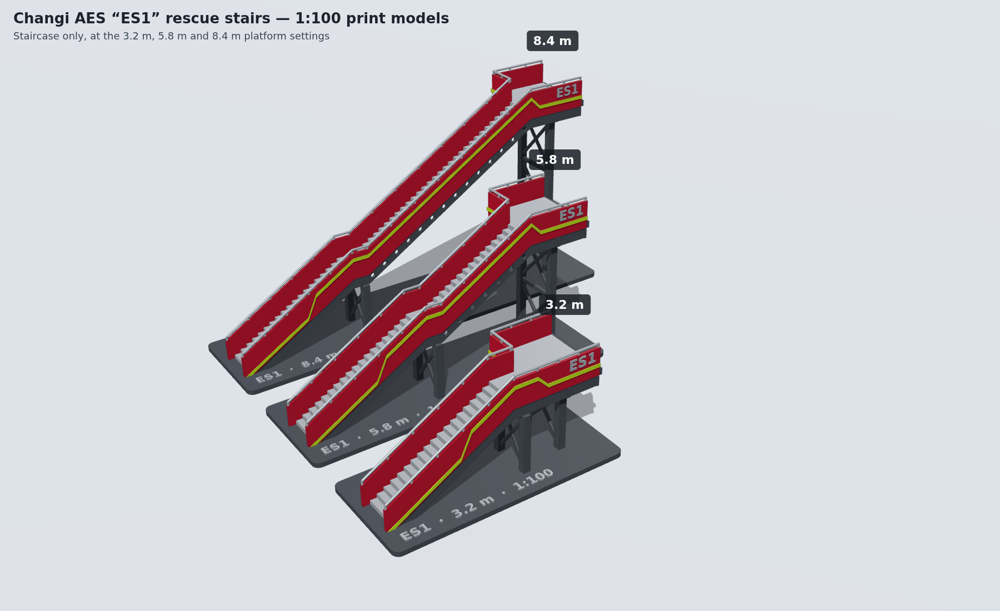
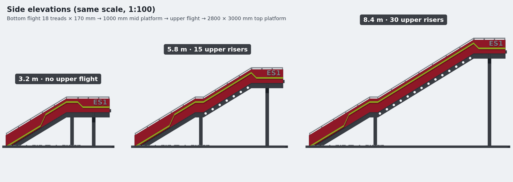

# Changi AES "ES1" rescue stairs – 3D print model

This folder has 3D-print models of the rescue stairs on Changi Airport Emergency Service's
Rosenbauer E8000-type stair truck. They cover the staircase only, without the vehicle, at three
platform heights. The models are 1:100 scale and come with a display stand, so each one stands
on its own.



## Design

| Item | Value | Source |
|---|---|---|
| Stair width (clear, between side panels) | 1500 mm | brief (matches Rosenbauer spec) |
| Step height | 170 mm | brief |
| Bottom flight | 18 treads / 19 risers, landing at 3230 mm | brief |
| Mid platform length | 1000 mm | brief |
| Tread depth (going) | 280 mm, about 31° pitch | assumed from photos |
| Top platform | 2800 × 3000 mm, flush with the right-hand side and extending left | Rosenbauer E8000 data, photos |
| Guard panel / handrail | 900 mm / 1050 mm above the pitch line | assumed |

The steps stay close to 170 mm at every setting, so only the upper flight changes:

| Model | Top platform | Upper flight | Size at 1:100 (L × W × H) |
|---|---|---|---|
| 3.2 m | 3.23 m (19 × 170) | none: the mid platform runs straight onto the top platform | 98 × 45 × 45 mm |
| 5.8 m | 5.80 m | 15 risers × 171.3 mm | 138 × 45 × 71 mm |
| 8.4 m | 8.40 m | 30 risers × 172.3 mm | 180 × 45 × 97 mm |



## Files

- `stl/ES1_stairs_<h>_1-100.stl`: the main print. One solid body with the display stand and a
  name plate on the base.
- `stl/stair_only/…_stair_only.stl`: the staircase with no stand, for mounting on your own base
  or vehicle.
- `stl/multicolour/<model>/…_{red,silver,grey,lime}.stl`: the same model split into colour
  bodies for multi-material printers such as Bambu AMS or Prusa MMU. Load all four files at
  once as a single object with multiple parts, then assign a filament to each part.
- `stl/models.json`: step counts and dimensions for every file.
- `generate_stairs.py`: the parametric generator.

Every STL is checked to be watertight (manifold) and a single connected body.

## Printing tips

- **FDM:** print upright on the base with a 0.4 mm nozzle and 0.12–0.16 mm layers. Turn on tree
  supports and allow them to start on the model, not only on the build plate. The underside of
  the flights and the platforms needs support, but the treads, panels and towers don't.
- **Resin:** tilt the model about 30° and put supports on the underside.
- The livery (lime stripes and "ES1") is raised by 0.4 mm, so it also serves as a painting guide
  on a single-colour print.
- **Other scales:** scaling in the slicer is fine for going bigger. For example, 200% gives 1:50,
  but the 8.4 m model is then about 360 mm long. For a smaller scale, regenerate the files so the
  thin parts stay printable:

```bash
pip install manifold3d trimesh numpy matplotlib
python3 generate_stairs.py --scale 87 --heights 3200 5800 8400
```

Every design value, such as tread depth, platform size, livery or the label, is in the
`Design` dataclass at the top of the script.

## Two-track stair climber simulation

`track_sim/` checks whether a tracked casualty carrier can cross the ES1 stairs, including the
flat mid platform, when it is split into a front and a rear track unit joined by a driven
hinge. It carries a person in a reclining stretcher-chair on a driven levelling pivot, and
compares that vehicle with the same vehicle built as one long straight track.

Open `track_sim/index.html` in a browser, keeping `track-model.js` in the same folder. The page
animates the trip up or down at each height setting, plots the casualty's tilt and the hinge
bend, and recalculates everything when you change the seat or the vehicle, including a layout
with one half of the tracks split in two. `track-model.js` also runs in Node:

```bash
node -e "const TM = require('./track_sim/track-model.js'); console.log(TM.simulate({ height: 8.4 }).summary.two)"
```

### Default design

- **Vehicle:** 0.70 m units (sprocket centre to sprocket centre), a 90 mm sprocket radius, and
  25 kg per unit. The hinge bends ±55° at up to 120° per metre of travel.
- **Seat:** a 120 kg person reclined 45° from vertical, in a stretcher-chair that weighs 25 kg
  with its drives. It sits on an arm 0.5 m above the hinge axle, so every posture from sitting up
  to lying flat fits. The seat's load centre is set 15 cm towards the head from the arm. The
  person rides head uphill: backwards going up and facing forward coming down.
- **Balance arm:** a drive at the foot of the arm leans it up to ±50° from halfway between the
  units, at 60° per metre of travel. It keeps the weight away from whichever edge the vehicle is
  near. Drives on top of the arm keep the seat level.

### Results

Worst case over the three height settings.

| | Two tracks + driven hinge | One long track |
|---|---|---|
| Casualty tilt, worst moment | 5° (the seat drives catch up within 3 cm) | 25° |
| Vehicle pitch change per 10 cm of travel | 7.9° up, 8.6° down | 31.6° |
| Worst drop at a platform edge | none, up or down | 23 cm (tips over the edge) |
| Lean it can take anywhere before it falls | 10.7° up, 8.3° down | falls at every edge |
| Hinge bend used | ±40° | – |

"Lean it can take" is how far a push, a hard stop or a bump can lean the weight before the
vehicle falls over an edge. A stop from walking pace (0.25 m/s) in 0.2 s leans it 7.3°.

The fit of the seat and person depends on the recline. With the default 0.5 m arm, the closest
gaps to the steps and to the vehicle's own tracks are:

| Recline | Posture | To the steps | To its own tracks |
|---|---|---|---|
| 15° | sitting up | 25 cm | 6 cm |
| 30° | leaning back | 34 cm | 15 cm |
| 45° | half lying, half sitting | 45 cm | 25 cm |
| 60° | half lying | 45 cm | 28 cm |
| 75° | mostly lying | 26 cm | 21 cm |
| 90° | lying flat | 11 cm | 2 cm (tight) |

### How the seat is held up

A level stretcher over a 31.6° flight has stairs about 0.6 m higher under one end of each metre
than the other, and the slope reverses at every platform. Legs on each track unit would have to
grow and shrink by that much all the time, so the support sits in the middle, on the hinge axle.
Operating tables hold lying patients the same way, on one central column with a tilting top.
The support is built to look and be sturdy:

1. **Two track units**, front and rear, each with a left and a right rubber track, 0.75 m across.
   The tracks have cleats that hook the step nosings.
2. **Hinge axle and hinge motor.** A 40 mm steel axle joins the units. A self-locking gear motor
   bends the hinge and holds a fold with the power off, about 580 N·m (1.2 kN·m with bumps). It
   must turn at least 90° per metre of travel (23°/s at walking pace).
3. **Averaging link.** A 150 mm arm fixed to each unit, and two equal links to a collar on a short
   post. The four equal sides make a diamond, so that post always points halfway between the two
   units. The arm leans from it, and it passes the arm's load equally into both units.
4. **Arm drive.** A self-locking gear motor at the foot of the arm leans it up to ±50° from halfway
   at 15°/s. It holds up to 500 N·m (1 kN·m with bumps).
5. **Arm.** Two 50 × 50 × 4 mm steel box columns 0.4 m apart, joined by cross tubes, 0.5 m from
   the hinge axle to the seat's tilt axle. The two columns stop it rocking sideways.
6. **Tilt drives and cradle.** Two self-locking tilt drives on top of the columns keep the seat
   level; either one can hold the seat alone. A cradle of two 40 × 40 × 3 mm rails and struts
   holds the seat on a triangle, not on a single point.
7. **Stretcher-chair.** Reclines from 15° (sitting up) to 90° (flat), with a four-point harness
   and a foot stop so the person can't slide more than about 10 cm.

Side to side, the centre of mass is 0.71 m off the ground, so a 0.75 m wide vehicle only tips
past 28° of side tilt. The stairs have no side slope, so that margin covers the person shifting
and bumps.

### Stress test

`stress-test.js` puts the default design through harder conditions at all three height settings,
in both directions, and sizes the support parts at twice the worst load:

```bash
cd track_sim && node stress-test.js
```

It also writes `stress-results.js`, which the page shows. A case passes if the vehicle never
falls and can take a 7.3° lean anywhere. It runs four ways of holding up the seat, and the two
layouts with one half of the tracks split in two (see below):

| Seat support | Pass | Tight | Fail | Lean it can take, default (up · down) | Seat drives, with bumps |
|---|---|---|---|---|---|
| One balancing arm (recommended) | 17 | 4 | 3 | 10.7° · 8.3° | arm drive 1.0 kN·m, two tilt drives 0.48 kN·m |
| Two arms from the hinge (a V) | 12 | 6 | 3 | 9.5° · 7.8° | two arm drives 0.82 kN·m |
| Two arms, one on each track | 7 | 7 | 7 | 16.1° · 9.9° | two arm drives 0.89 kN·m |
| One arm without a drive | 7 | 9 | 5 | 8.0° · 8.2° | two tilt drives 0.48 kN·m |

One case is not a stress but a possible fix: a hinge motor half as fast again (180°/m). With the
balancing arm it passes, taking 13.1° up and 7.8° down.

Two arms holding the stretcher like a bed look the most reassuring, but only if they rise from
the hinge. Standing on the track units, the arms' feet swing at every fold and, on the flights,
one sits about 25 cm lower than the other. The arms have to keep correcting: on steeper stairs
the cradle tilts up to 16°, lying flat hits the steps, and the vehicle needs a faster, wider
hinge. Rising from the hinge, the two arms keep most of the single arm's stability. They lose
margin only with a 200 kg person, a person who has slid 25 cm, or a smaller hinge.

The single balancing arm passes the most cases. Its results case by case:

- **Passes:**
  - a 200 kg or a 40 kg person;
  - a person sliding 10 cm either way, or 25 cm towards the feet;
  - sitting up, or lying flat and sliding;
  - stairs as steep as 35.8°;
  - a hinge at three-quarter speed or with only ±45° of range, or one half as fast again;
  - a seat drive at half speed;
  - an arm drive that seizes in the middle or leaning uphill;
  - a seat drive stuck level, with the arm taking over the levelling.
- **Tight:**
  - lying flat comes within 2 cm of the front track;
  - an arm drive seized leaning 20° downhill;
  - a seat drive stuck on a flight;
  - a 200 kg person half lying on 35.8° stairs.

  None of these falls, but a hard stop at the worst moment could rock the vehicle.
- **Fails:**
  - a hinge motor at half speed drops 17 cm at an edge;
  - a hinge motor that seizes and keeps driving becomes one long track and drops 23 cm;
  - a 200 kg person lying flat on 35.8° stairs hits the tracks.

Without its drive, the arm only passes the default case with 8.0°. It fails with the person
sliding 25 cm, and is tight on steeper stairs and with a ±45° hinge. That is why the balance arm
is part of the design.

The support parts stay 6 to 100 times below their limit at twice the worst load for a 120 kg
person, and at least 3.7 times below for 200 kg. What the stress test asks for:

1. Keep the balance arm.
2. Use a hinge motor that turns at least 90° per metre of travel.
3. Stop the tracks the moment the hinge stops following.
4. After any drive fault, stop gently over half a second. That leans the weight only 2.9°,
   which every tight case can take.
5. Fit a four-point harness and a foot stop.
6. Make the arm about 5 cm taller if people will be carried lying flat on steeper stairs.
7. Use cleated tracks. Holding on the flight needs a grip (friction coefficient) of 0.61, and a
   hard stop going down 0.76. Wet rubber on steel can be well below that.

### One half split in two

The model also handles more than two sections (`sections` and `mainJoint` in `track-model.js`,
and "Track layout" on the page). The seat stays on the middle hinge. One half is split into two
0.35 m sections, joined by a hinge with its own motor, about 6 kg. The rules are the same as for
two sections, section by section. With two 0.70 m sections, the model gives exactly the same poses
as the two-section one, which is how it was checked.

The extra hinge helps only while its half trails: going down for a split front half, going up for
a split rear half. As that half comes over a platform edge, its end section stays flat on the
platform while the section next to the seat follows the new slope. The trailing end keeps holding
the vehicle up just when a straight unit would lift off and leave it balancing on the edge. While
its half leads, the extra hinge is held straight. A short section has to turn twice as fast for
the same change of slope, so the extra hinge turns at up to 240° per metre, twice the seat's hinge.

Worst case over the three height settings, with the balancing arm:

| | Two sections | Front half split | Rear half split |
|---|---|---|---|
| Lean it can take (up · down) | 10.7° · 8.3° | 10.3° · 18.7° | 17.9° · 10.0° |
| Stress test (pass · tight · fail) | 17 · 4 · 3 of 24 | 20 · 3 · 3 of 26 | 19 · 4 · 3 of 26 |
| Extra hinge at 120°/m (up · down) | – | 10.3° · 9.3° | 13.3° · 10.0° |
| Extra hinge held straight (up · down) | – | 10.3° · 7.7° | 10.0° · 10.0° |

- The front split more than doubles the lean the vehicle can take going down, which is where two
  sections are weakest. Going up it takes 0.4° less, because of the motor's weight.
- The rear split gains going up. Its gain going down comes only from the motor's weight at the
  rear; ballast would do the same.
- Both fail the same three cases as two sections: a hinge motor at half speed, the seat's hinge
  seizing (a 21 to 23 cm drop), and a 200 kg person lying flat on 35.8° stairs.
- If the extra hinge seizes straight, the vehicle becomes the two-section one, which passes.
- A 0.35 m section spans only one gap between nosings, so on a flight its hinge must hold it in
  line.
- Used the other way round, the extra hinge makes things worse. Bending while its half leads, the
  short end section folds first and the seat's hinge later. Held straight while its half trails,
  there is nothing to gain.
- Splitting both halves (four 0.35 m sections) took about 18° both ways in a quick run, but it has
  not been stress tested.

### Design rules from the math

1. Each unit must always bridge two step nosings. Nosings are 328 mm apart, so a unit needs at
   least 657 mm.
2. One unit (0.88 m overall) must fit on the 1.0 m mid platform. The whole vehicle is longer than
   the platform, so it crosses in an S-bend.
3. The hinge needs a range of at least ±45°, even though the slope only changes by 31.6°. It has
   to fold the leading unit down before the middle reaches the edge.
4. The hinge must be driven, at 90–150° per metre of travel. Slower, the fold comes too late and
   the vehicle drops at an edge. Much faster, it over-reacts. With a free hinge, the units follow
   gravity and the front rears up on the risers.
5. The hinge holds its fold over an edge until the centre of mass is 5 cm past it, so the trailing
   unit keeps its end on the stairs.
6. The vehicle must be able to take a hard stop anywhere, a 7.3° lean. The balance arm and the
   seat's offset towards the head give it at least 8.3°.
7. Half lying (a 45–60° recline) is the most compact posture. Sitting up and lying flat both need
   the 0.5 m arm.
8. A split half's hinge bends only while that half trails, at twice the seat hinge's speed, and
   holds its two sections in line while that half leads.

The model is quasi-static (slow speed). At every centimetre it solves how both units rest on the
real step geometry, then checks support, the gap around the seat and person, and tipping. Tracks
ride on the line joining the step nosings. The person is a 1.80 m adult built from standard
body-segment proportions. Forces and torques are for slow, steady driving, with a factor of two
for bumps; impacts and braking dynamics are not modelled.
